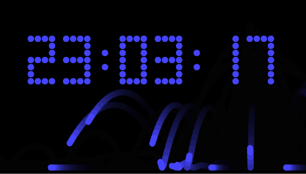

# Dot Clock

## Click the image to check the time!    

[](https://nhrones.github.io/Clock/)    

## About this app
This small app was built as a learning exercise for a grandson who was studing CS at UGA. That's why all code in the _/src/_ folder is **_heavily commented_**! 

## No Jank!
The interesting bits of this exercise was the use of a resource-pool to improve performance and reduce V8-GC.    
  - See: _/src/dotPool.ts_

## Unique partical effect
Below the clock are four slider controls. Try moving each slider to change the animation.    
The **_partical-trails_** slider is most interesting. It controls the RGBA alpha channel to gradually fade out trails. The higher the slider value, the less trail fade.   

## Run Online
https://nhrones.github.io/Clock/

# HOT
This simple app demonstrates running my Hot-dev-server directly from JSR.   
This app was built using my <a href="https://github.com/nhrones/Devtools_Hot">**_Hot_**</a> dev server.   
The contents in the **/src/** folder have been bundled into the **_./dist/bundle.js_** file.  

## Copy this Repo to use/learn about the Hot dev server
  - Download and load a local copy in vsCode.
  - To run Hot, press **_ctrl+shift+b_**  (the vscode build shortcut)
  - This will start the Hot-dev-server from JSR
  - To see how this is configured, open the ./.vscode/tasks.json file and see HOT

  This app is configured to code and build all front-end javascript from typescript files located in the /src/ folder.   
  These **ts** files are auto-transpiled and bundled on-change to a single ./dist/bundle.js file.   
  The _index.html_ file in the root folder loads this javascript bundle.js and a css file from the /dist/ folder:   
  ```
     <link rel="stylesheet" href="./dist/styles.css" />
     <script type="module" src="./dist/bundle.js"></script>
  ```
Any changes to any ts file in the /src/ folder will cause a build/bundle/refresh of the browser.   
Any changes to any css file in the /dist/ folder will cause a refresh of just the styles in the browser.   

